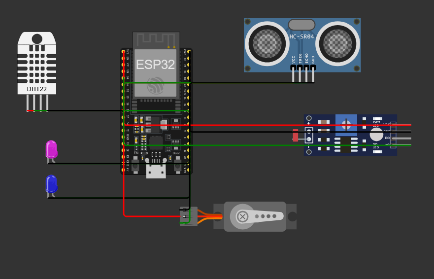
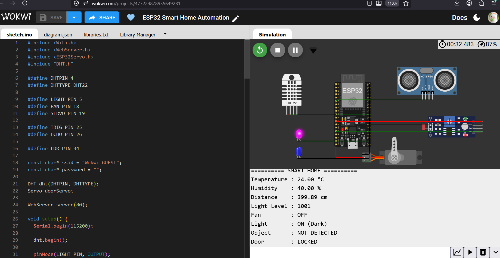
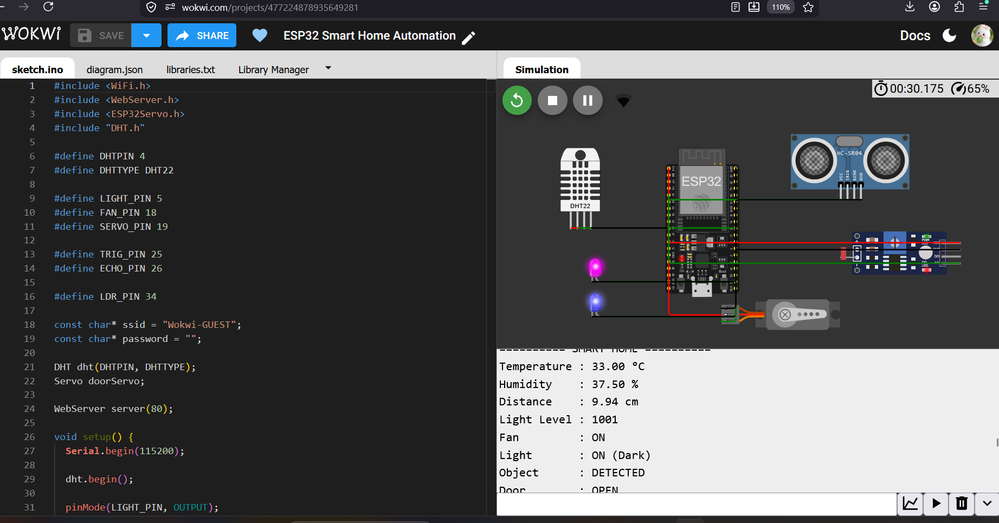

# 🏠 ESP32 Smart Home Automation System

An IoT-based smart home automation system built using **ESP32** and multiple sensors. The system monitors environmental conditions, detects nearby objects, and automatically controls home appliances and a smart door.

## 🚀 Project Overview

This project demonstrates how an ESP32 can be used as the central controller of a smart home system.

The system uses:

- 🌡️ DHT22 — Temperature & Humidity Monitoring
- 💡 LDR — Automatic Light Control
- 📡 HC-SR04 — Object/Distance Detection
- 🚪 Servo Motor — Smart Door Control
- 🔴 LED — Light Simulation
- 🔵 LED — Fan Simulation
- 📶 ESP32 Wi-Fi — IoT Connectivity

## ⚙️ Features

### 🌡️ Automatic Fan Control
If the temperature rises above **25°C**, the fan is automatically turned ON.

### 💡 Automatic Light Control
The LDR monitors the surrounding light level.

- Dark → Light ON
- Bright → Light OFF

### 🚪 Smart Door
The ultrasonic sensor detects nearby objects.

- Object within 20 cm → Door OPEN
- No nearby object → Door LOCKED

### 📊 Environmental Monitoring
The DHT22 continuously measures:

- Temperature
- Humidity

## 🔌 Pin Configuration

| Component | ESP32 Pin |
|---|---|
| DHT22 Data | GPIO 4 |
| Light LED | GPIO 5 |
| Fan LED | GPIO 18 |
| Servo PWM | GPIO 19 |
| HC-SR04 TRIG | GPIO 25 |
| HC-SR04 ECHO | GPIO 26 |
| LDR Analog Output | GPIO 34 |

## 🛠️ Technologies Used

- ESP32
- Arduino C++
- DHT22
- LDR
- HC-SR04
- Servo Motor
- LEDs
- Wi-Fi
- Wokwi Simulator

## 🧪 Testing

### Normal / Dark Condition

- Temperature: 24°C
- Humidity: 40%
- Light Level: 1001
- Fan: OFF
- Light: ON
- Door: LOCKED

### Bright Condition

- Light Level: if >2500
- Light: OFF

### Object Detection

- Distance: ~10 cm
- Object: DETECTED
- Door: OPEN

### High Temperature

- Temperature: 33°C
- Fan: ON

## 📸 Project Screenshots

### Wokwi Circuit

### Normal Condition

### Automation Test

## 🎯 Learning Outcomes

Through this project, I learned:

- ESP32 GPIO control
- Sensor interfacing
- Analog sensor reading
- Distance measurement
- Servo motor control
- Conditional automation
- Wi-Fi initialization
- IoT system design
- Hardware simulation using Wokwi

## 👩‍💻 Author

**Tanisha Karan**

B.Tech — Computer Science / Internet of Things

---

⭐ This project is part of my journey toward becoming an **IoT Engineer**.
